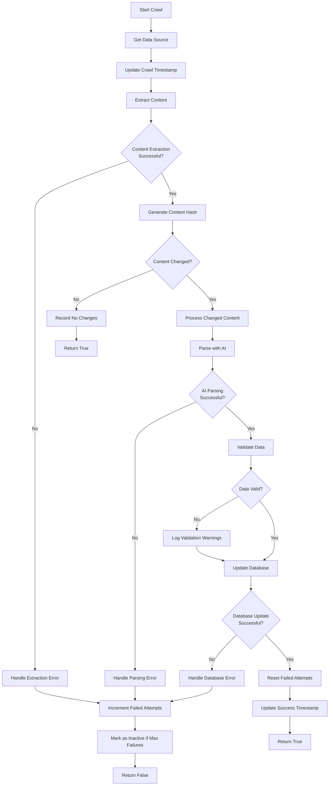
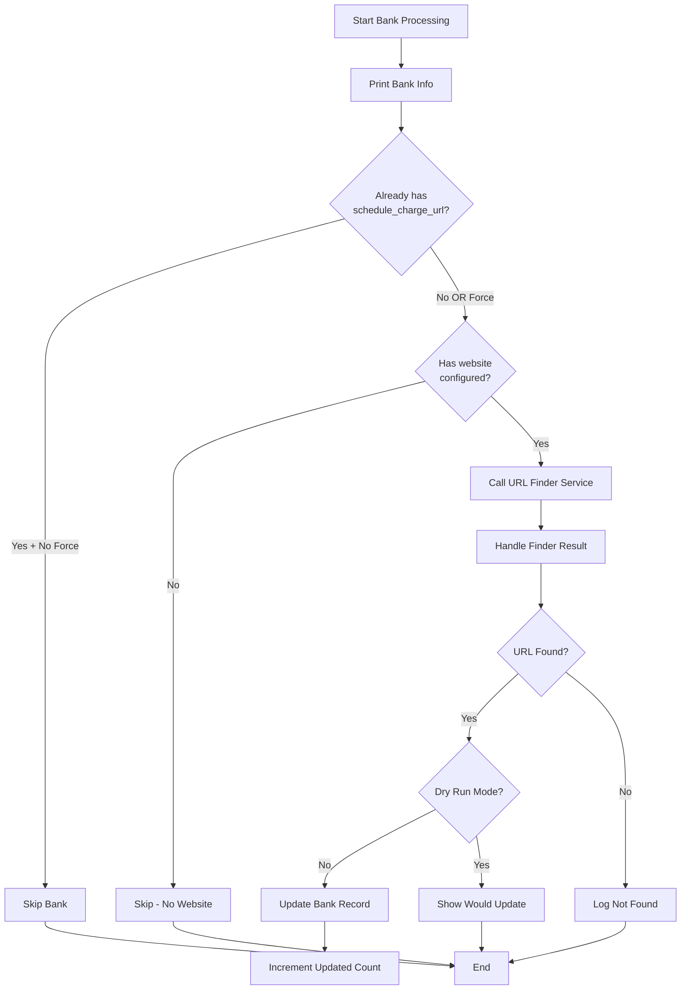
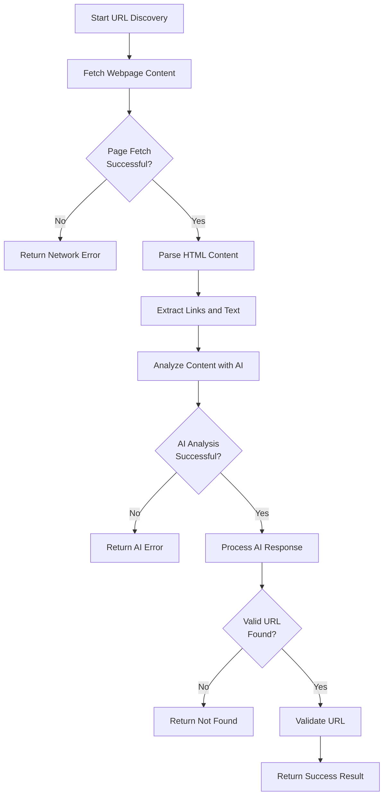

# Management Command Flows Documentation

This document provides detailed documentation of the two main management commands in the Credit Mate AI project and their complete execution flows.

## Overview

The project includes two primary Django management commands:

1. **`crawl_bank_data`** - Extracts and processes credit card data from bank sources
2. **`find_schedule_charge_urls`** - Discovers schedule of charges URLs on bank websites

## Command 1: `crawl_bank_data`

### Purpose
Crawls bank credit card data from configured data sources (PDFs, webpages, images, CSV files) and processes them using AI to extract structured credit card information.

### Usage

```bash
# Crawl all active data sources
python manage.py crawl_bank_data

# Crawl specific bank
python manage.py crawl_bank_data --bank-id 1

# Crawl specific data source
python manage.py crawl_bank_data --source-id 5

# Dry run (preview what would be crawled)
python manage.py crawl_bank_data --dry-run
```

### Command Arguments

| Argument | Type | Description |
|----------|------|-------------|
| `--bank-id` | int | ID of specific bank to crawl (crawls all if not specified) |
| `--source-id` | int | ID of specific data source to crawl |
| `--dry-run` | flag | Show what would be crawled without actually crawling |

### Execution Flow

#### 1. Command Entry Point (`Command.handle()`)
```
Input Validation → Service Initialization → Route to Processing Mode
```

#### 2. Processing Modes

**A. Single Data Source Mode (`--source-id`)**
```
Validate Source ID → Fetch BankDataSource → Call Crawler Service → Display Result
```

**B. Single Bank Mode (`--bank-id`)**
```
Validate Bank ID → Get Active Data Sources → Process Each Source → Aggregate Results
```

**C. All Sources Mode (default)**
```
Get All Active Sources → Call Bulk Crawler Service → Display Summary
```

#### 3. Core Crawling Pipeline (`BankDataCrawlerService.crawl_bank_data_source()`)



#### 4. Content Extraction Pipeline (`ContentExtractor`)

```
URL Input → Detect Content Type → Route to Specific Extractor
```

**Content Type Handlers:**
- **PDF**: `PyPDF2` → Extract text from PDF pages
- **WEBPAGE**: `requests + BeautifulSoup` → Extract visible text from HTML
- **IMAGE**: `Pillow + pytesseract` → OCR text extraction
- **CSV**: `csv` module → Parse and convert to text

#### 5. AI Parsing Pipeline (`LLMContentParser`)

```
Extracted Text → OpenAI GPT-4 → Structured JSON → Data Validation
```

**AI Prompt Structure:**
- System prompt defining credit card data schema
- Content prompt with extracted text
- JSON response validation and cleanup

#### 6. Data Processing Pipeline (`CreditCardDataService`)

```
Parsed JSON → Validate Fields → Create/Update CreditCard Records → Link to CrawledContent
```

### Error Handling

1. **Network Errors**: Retry mechanism with exponential backoff
2. **Content Extraction Errors**: Log and mark source as failed
3. **AI Parsing Errors**: Fallback strategies and validation
4. **Database Errors**: Transaction rollback and error logging
5. **Failed Attempt Tracking**: Auto-deactivate sources after 5 failures

### Output Summary

The command provides:
- Real-time processing status for each source
- Success/failure counts
- Current data sources summary with health status
- Failed sources with attempt counts

---

## Command 2: `find_schedule_charge_urls`

### Purpose
Automatically discovers and extracts schedule of charges or fee document URLs from bank websites using AI-powered content analysis.

### Usage

```bash
# Process all active banks
python manage.py find_schedule_charge_urls

# Process specific bank by ID
python manage.py find_schedule_charge_urls --bank-id 1

# Process banks by name (case-insensitive partial match)
python manage.py find_schedule_charge_urls --bank-name "Chase"

# Dry run (preview without making changes)
python manage.py find_schedule_charge_urls --dry-run

# Force update existing URLs
python manage.py find_schedule_charge_urls --force
```

### Command Arguments

| Argument | Type | Description |
|----------|------|-------------|
| `--bank-id` | int | Process only the specified bank ID |
| `--bank-name` | str | Process banks matching name (case-insensitive) |
| `--dry-run` | flag | Show what would be done without making changes |
| `--force` | flag | Update schedule_charge_url even if it already exists |

### Execution Flow

#### 1. Command Entry Point (`Command.handle()`)
```
Parse Arguments → Get Banks to Process → Initialize Results → Process Each Bank → Print Summary
```

#### 2. Bank Selection Logic

```
Input Arguments → Apply Filters → Return Filtered Bank List
```

**Selection Modes:**
- **By ID**: Single bank with specific ID
- **By Name**: Banks matching name pattern (case-insensitive)
- **All Active**: All banks with `is_active=True` (default)

#### 3. Single Bank Processing Flow (`_process_single_bank()`)



#### 4. URL Discovery Pipeline (`ScheduleChargeURLFinder.find_schedule_charge_url()`)



#### 5. AI Analysis Process

**Step 1: Content Preparation**
```
Webpage HTML → BeautifulSoup Parsing → Text Extraction → Link Collection
```

**Step 2: AI Prompt Construction**
```python
# System prompt defining the task
system_prompt = """
Find schedule of charges or fee documents from bank webpage content.
Look for links containing terms like:
- schedule of charges
- fee schedule
- pricing
- rates and fees
"""

# User prompt with webpage content
user_prompt = f"""
Analyze this bank webpage content and find schedule of charges URLs:
{webpage_content}
"""
```

**Step 3: Response Processing**
```
AI JSON Response → URL Extraction → Validation → Result Formatting
```

#### 6. URL Validation Process

```
Extracted URL → Format Validation → Accessibility Check → Content Type Detection
```

**Validation Steps:**
1. **Format Check**: Valid URL structure
2. **Accessibility**: HTTP HEAD request to verify URL exists
3. **Content Type**: Detect if PDF or webpage
4. **Relevance**: Confirm content relates to charges/fees

### Detection Methods

The service employs multiple detection strategies:

1. **Direct Link Analysis**: Scans for links containing relevant keywords
2. **Content Analysis**: AI analyzes page text for charge/fee mentions
3. **Pattern Recognition**: Identifies common URL patterns for fee documents
4. **Contextual Understanding**: Uses AI to understand page structure and navigation

### Common Detection Patterns

- **PDF Documents**: `*/schedule-charges.pdf`, `*/fees-charges.pdf`
- **Dedicated Pages**: `*/fees-and-charges/`, `*/pricing/`, `*/rates/`
- **Navigation Links**: Links in footer, main menu, or resources sections
- **Embedded Documents**: PDF viewers or document links within pages

### Error Handling

1. **Network Failures**: Timeout and connection error handling
2. **HTML Parsing Errors**: Malformed HTML graceful handling
3. **AI Service Errors**: Fallback to pattern-based detection
4. **URL Validation Failures**: Comprehensive error reporting
5. **Database Update Errors**: Transaction safety with rollback

### Output Summary

The command provides:
- 🏦 Bank name and website being processed
- ✅ Success indicators with found URLs
- 📝 Detection method used (AI analysis, pattern matching, etc.)
- 🔍 Search patterns that led to discovery
- 💾 Database update confirmation
- 📊 Final summary with counts and statistics
- ⚠️ Warning messages for skipped banks
- 💥 Error details for failed processing

### Success Result Format

```json
{
  "found": true,
  "url": "https://bank.com/schedule-of-charges.pdf",
  "method": "ai_analysis",
  "content_type": "PDF",
  "pattern": "schedule.*charges",
  "confidence": "high"
}
```

### Error Result Format

```json
{
  "found": false,
  "method": "attempted_method",
  "error": "Detailed error message",
  "attempts": ["ai_analysis", "pattern_matching"]
}
```

---

## Integration with Background Tasks

Both commands are integrated with Celery for scheduled execution:

### Scheduled Tasks

- **Weekly Bank Data Crawling**: `crawl_all_bank_data` task runs weekly
- **Monthly URL Discovery**: `monthly_schedule_charge_url_discovery` task runs monthly
- **Data Quality Checks**: Monthly validation of data source health

### Task Configuration

```python
# Celery Beat Schedule
CELERY_BEAT_SCHEDULE = {
    'weekly-bank-crawling': {
        'task': 'banks.tasks.crawl_all_bank_data',
        'schedule': crontab(day_of_week=1, hour=2, minute=0),  # Monday 2 AM
    },
    'monthly-url-discovery': {
        'task': 'banks.tasks.monthly_schedule_charge_url_discovery',
        'schedule': crontab(day_of_month=1, hour=3, minute=0),  # 1st day 3 AM
    },
}
```

---

## Configuration Requirements

### Environment Variables

```bash
# Required for both commands
DATABASE_URL=postgresql://...
SECRET_KEY=...

# Required for AI parsing (crawl_bank_data)
OPENAI_API_KEY=...

# Required for URL discovery (find_schedule_charge_urls)
GOOGLE_GENAI_API_KEY=...

# Optional - Redis for Celery
CELERY_BROKER_URL=redis://localhost:6379/0
```

### Dependencies

```python
# Core Django and database
Django>=5.2
psycopg2-binary
celery[redis]

# Content extraction
PyPDF2
beautifulsoup4
Pillow
pytesseract
requests

# AI services
openai
google-generativeai
```

---

## Troubleshooting

### Common Issues

1. **Missing API Keys**: Commands fail with authentication errors
2. **Network Timeouts**: Large PDF processing or slow websites
3. **OCR Failures**: Image content extraction requires tesseract installation
4. **Database Locks**: Concurrent crawling causing transaction conflicts
5. **AI Rate Limits**: OpenAI/Google API rate limit exceeded

### Debug Commands

```bash
# Test specific data source
python manage.py crawl_bank_data --source-id 1 --dry-run

# Test URL discovery for one bank
python manage.py find_schedule_charge_urls --bank-id 1 --dry-run

# Check system configuration
python manage.py check
python manage.py migrate --check
```

### Log Analysis

Both commands provide comprehensive logging:

```python
# Enable debug logging
LOGGING = {
    'loggers': {
        'banks.services': {
            'level': 'DEBUG',
            'handlers': ['console', 'file'],
        },
        'banks.management.commands': {
            'level': 'INFO',
            'handlers': ['console'],
        },
    },
}
```
